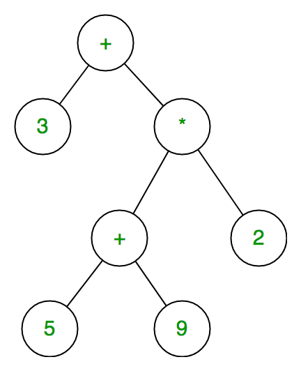

## Język skryptowy
Python - [dokumentacja](https://docs.python.org/3/tutorial/index.html)

## Zadanie
Napisz program, który pozwoli użytkownikowi na obliczenie zdefiniowanego przez niego równania.

Wymagania:
1. ***(4 ptk.)*** Program musi pytać użytkowania o zdefiniowanie równania w formie jednego ciągu znaków:
1 + 2 * 3
Dla którego następni obliczy wynik
1 + 2 * 3 = 7
2. ***(2 ptk.)*** Poszczególne podwyrażenia równania powinny być przechowywane w słowniku/drzewie
   
   

3. ***(1 ptk.)*** Program umożliwia opcję wizualizacji drzewa równań/wyrażeń
4. ***(1 ptk.)*** Program wspiera podstawowe operacje arytmetyczne (uwzględniając pierwszeństwo operacji): 
   - `+` ➡ dodawanie
   - `-` ➡ odejmowanie
   - `*` ➡ mnożenie
   - `/` ➡ dzielenie
5. ***(1 ptk.)*** Program wspiera zagnieżdżone operacje arytmetyczne:
   - `()` ➡ operacje w nawiasach
6. ***(1 ptk.)*** Program wspiera liczby rzeczywiste (obsługuje operacje zmiennoprzecinkowe).

## Publikowanie rozwiązań
Rozwiązania umieść w folderze `Solutions` i opublikuj w formie ***Pull Request*** do tego repozytorium do gałęzi odpowiadającej Twojemu numerowi identyfikacyjnemu.